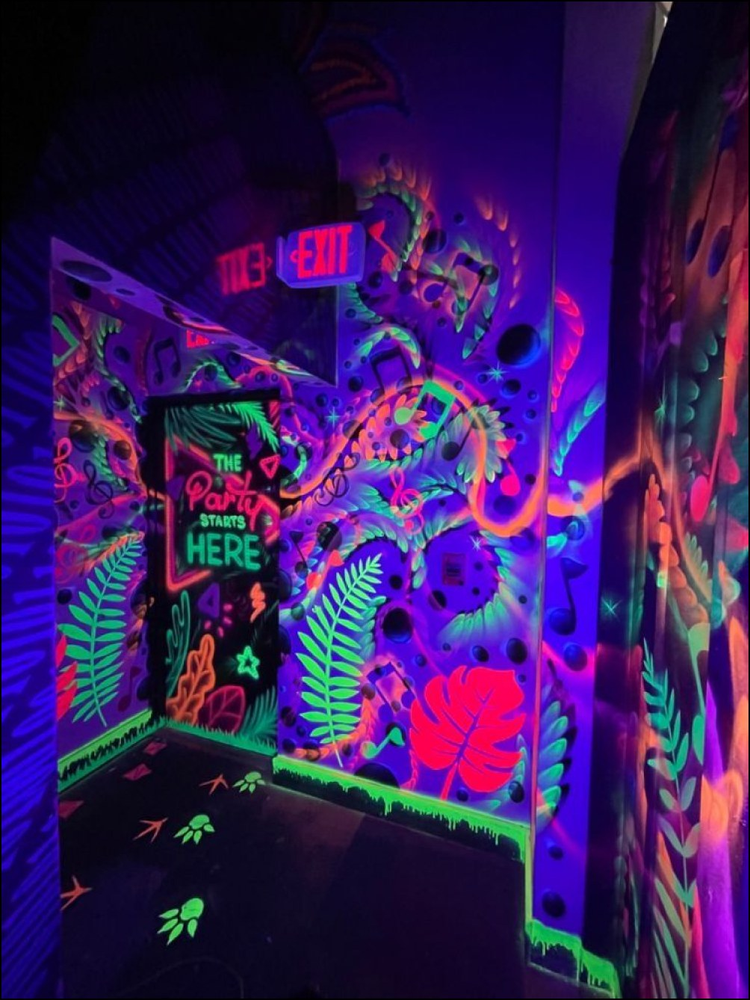

# Glow / Gloom — site moodboard

> Mise à jour : le mur d'images est maintenant un vrai nuage organique —
> positions calculées (pas de grille CSS), tailles variées, jamais alignées
> en lignes/colonnes, jamais superposées, espacement régulier — avec une
> apparition en fondu, un léger tilt 3D au survol de chaque photo et une
> lueur qui suit le curseur. Bug corrigé : la scrollbar fantôme provoquée
> par l'effet VHS de Gloom. Le lecteur Spotify reste tel quel (voir plus
> bas pourquoi aucun service en ligne ne peut vraiment démarrer le son
> automatiquement). Anciennes notes : transitions réparées (plus de flash
> rose), musique branchée sur Spotify (plus de mp3 local), trait de
> séparation sur l'accueil qui suit l'agrandissement au survol.

Un site en HTML/CSS/JS pur (aucune installation, aucun build). Trois pages :

- `index.html` — accueil en écran divisé, deux portails vers les moodboards.
- `neon.html` — moodboard **Glow** (lumière noire / rave).
- `horror.html` — moodboard **Gloom** (horreur / folklore).

Ouvre simplement `index.html` dans un navigateur (idéalement via un petit
serveur local type `python3 -m http.server`, pour que les chemins d'images
et polices se chargent sans souci de CORS).

## Structure

```
index.html / neon.html / horror.html   → les 3 pages
css/style.css                          → tokens, thèmes, page d'accueil
css/gallery.css                        → mur d'images, lightbox, lecteur audio
js/transitions.js                      → la transition "iris" entre les pages
js/gallery.js                          → rotation aléatoire du mur + lightbox
js/audio.js                            → lecture/pause de la musique
assets/neon/…, assets/horror/…         → les 13 images de chaque moodboard
assets/audio/                          → dépose ici tes fichiers musicaux
```

## Le nuage d'images

`gallery.js` calcule, pour chaque photo, une position `left`/`top` en
pixels : un masonry dense en colonnes, mais façonné par une courbe en
cloche à travers les colonnes (plus étroites, qui démarrent plus bas et
se remplissent moins vite vers les bords) — le nuage se resserre donc
naturellement autour d'un point central, avec de la marge visible tout
autour, plutôt que de former un rectangle plein bord à bord.

**Tient dans l'écran, sans scroll** — sur desktop/tablette (≥ 640px), une
fois le nuage calculé à sa taille naturelle, le script mesure la hauteur
encore disponible sous l'en-tête et, si besoin, ré-essaie plusieurs
échelles plus petites (en gardant le même nombre de colonnes à chaque
essai — c'est ce qui empêche l'échelle de tourner à l'envers) jusqu'à
trouver celle qui rentre vraiment, avec un plancher pour ne jamais
réduire les photos au point de les rendre illisibles. Sur mobile, le
nuage garde sa taille naturelle et la page défile normalement — sur un
petit écran, imposer "tout tient" rendrait les photos trop petites pour
qu'on les distingue.

Résultat : un espacement régulier partout, des tailles qui varient selon
le format de chaque photo, aucune ligne ni colonne stricte visible, et —
garanti par construction, pas par chance — jamais de chevauchement. Tout
se recalcule automatiquement au redimensionnement de la fenêtre.

## Ajouter / retirer une image

Dans `neon.html` ou `horror.html`, chaque photo est un bloc :

```html
<figure class="cloud-item">
  <div class="frame"><span class="pin"></span>
    
  </div>
</figure>
```

Copie ce bloc, change l'image (et l'`alt`, utile pour l'accessibilité et
le lightbox). Rien d'autre à toucher : `gallery.js` lit le DOM et
recalcule tout le nuage tout seul.

## Les interactions

- **Apparition** : chaque photo entre en fondu/zoom avec un léger
  décalage entre elles quand la page a fini de mesurer les images.
- **Tilt au survol** : le cadre s'incline légèrement vers le curseur
  (effet "carte magnétique"). Désactivé sur tactile et si
  `prefers-reduced-motion` est actif.
- **Lueur qui suit le curseur** : une lueur douce, couleur du thème, qui
  suit la souris avec un léger retard tant qu'elle est dans le nuage.
  Désactivée sur tactile / `prefers-reduced-motion`.
- **Épingle animée**, zoom lightbox avec navigation clavier (flèches,
  Échap) — inchangé.

## Pourquoi la musique ne démarre pas toute seule à l'arrivée

Tous les navigateurs (Chrome, Firefox, Safari) bloquent le son
automatique tant qu'il n'y a pas eu un geste direct de la personne sur
*cette même page*. C'est une règle du navigateur, pas une limite propre à
Spotify : aucun service en ligne (YouTube, SoundCloud, Bandcamp,
Deezer…) ne peut la contourner légitimement — en changer n'aurait rien
changé. Le seul vrai contournement demanderait de transformer le site en
single-page app (pour que le clic qui quitte l'accueil soit exactement
le même geste qui démarre un `<audio>`, sans navigation complète entre
les deux qui ferait perdre ce geste) — une refonte bien plus lourde que
ce correctif. En attendant, le panneau Spotify s'ouvre automatiquement à
l'arrivée : la musique est à un seul clic, pas cachée dans un menu, et
le bouton fait un petit pouls discret les premières secondes pour
l'indiquer.

## Changer la musique (Spotify)

La musique n'est plus un mp3 local : c'est un lecteur Spotify intégré,
chargé seulement quand on clique sur le bouton "Écouter" (rien n'est
demandé à Spotify avant ça). Pour changer la playlist, modifie l'attribut
`data-spotify-playlist` sur `.music-player` dans `neon.html` / `horror.html` :

```html
<div class="music-player" data-spotify-playlist="ID_DE_TA_PLAYLIST">
```

L'ID est la partie après `/playlist/` dans n'importe quelle URL
`open.spotify.com/playlist/...` publique. Le lien "ouvrir sur Spotify"
juste en dessous se met à jour à la main (deux endroits à changer : l'id
et le href de secours).

## Changer les couleurs / polices

Tout est piloté par des variables CSS en haut de `css/style.css` :

```css
[data-theme="neon"]{
  --bg: #07040f;
  --accent: #ff2bd6;
  --font-display: 'Unbounded', sans-serif;
  ...
}
```

Change une valeur ici, elle se répercute partout (titres, halos, bordures
au survol, lecteur audio, etc.). Si tu changes de police, pense à mettre à
jour le lien Google Fonts dans le `<head>` de chaque page.

## La transition entre les pages

`js/transitions.js` intercepte les liens marqués `data-transition` et joue
un cercle qui grandit depuis le point cliqué (couleur définie par
`data-wipe="#ff2bd6"` sur le lien) avant de charger la page suivante — puis
rejoue l'effet en sens inverse à l'arrivée. Pour désactiver cet effet sur un
lien, retire simplement `data-transition`.
